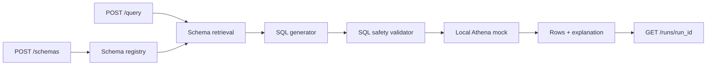

# Natural Language to Athena Analyst

Enterprise data assistant that converts natural language questions into governed Athena SQL, executes safe queries, and explains results.

## Why This Project

This project highlights the intersection of AI engineering, data engineering, and enterprise governance. It is a strong fit for your AWS, Athena, S3, backend, and analytics platform background.

## Target Resume Bullet

Built a natural-language analytics assistant that translates business questions into governed Athena SQL with schema retrieval, query safety checks, execution tracing, and result explanation.

## Architecture



## Implemented

- Retrieve relevant schemas and data dictionary entries.
- Generate Athena SQL from natural language.
- Validate SQL before execution.
- Estimate query cost and enforce limits.
- Explain results with generated SQL and returned rows.
- Trace generated SQL, retrieved tables, validation notes, rows, and latency.
- SQL safety blocks DDL/DML, multiple statements, non-SELECT queries, and queries
  without `LIMIT`.
- Tests cover safety validation, schema retrieval, SQL generation, mock Athena
  execution, and API traces.

## Local Development

```bash
python -m venv .venv
.\.venv\Scripts\activate
pip install -e ".[dev]"
uvicorn analyst.main:app --reload
python -m pytest
python -m ruff check .
```

## API Example

Register a sample schema:

```powershell
$body = Get-Content .\samples\loan_performance_schema.json -Raw

Invoke-RestMethod -Uri http://127.0.0.1:8000/schemas `
  -Method Post `
  -ContentType "application/json" `
  -Body $body
```

Ask an analytics question:

```powershell
$body = @{
  database = "analytics"
  question = "What is the average delinquency rate?"
  max_rows = 100
} | ConvertTo-Json -Depth 5

$result = Invoke-RestMethod -Uri http://127.0.0.1:8000/query `
  -Method Post `
  -ContentType "application/json" `
  -Body $body

$result
```

Inspect the run trace:

```powershell
Invoke-RestMethod -Uri "http://127.0.0.1:8000/runs/$($result.run_id)"
```

## Example Response

```json
{
  "sql": "SELECT AVG(delinquency_rate) AS average_delinquency_rate FROM analytics.loan_performance LIMIT 100",
  "safe": true,
  "rows": [
    {
      "average_delinquency_rate": 0.03
    }
  ],
  "row_count": 1
}
```

## Interview Talking Points

- Shows how to put governance around natural-language analytics instead of blindly executing model-generated SQL.
- Uses schema retrieval and data dictionary metadata to ground SQL generation.
- Validates generated SQL with `sqlglot`, blocks unsafe statements, and requires bounded `LIMIT` queries.
- Local Athena mock makes the workflow testable without AWS credentials while preserving the production adapter boundary.

## Roadmap

1. Add OpenAI or Bedrock SQL generation with schema-grounded prompts.
2. Add stricter governance: table allowlists, column masking, and cost limits.
3. Add real Athena adapter using `boto3`.
4. Add result-set comparison evals.
5. Add CI quality gates for SQL safety and golden query accuracy.
